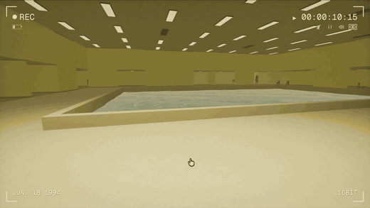
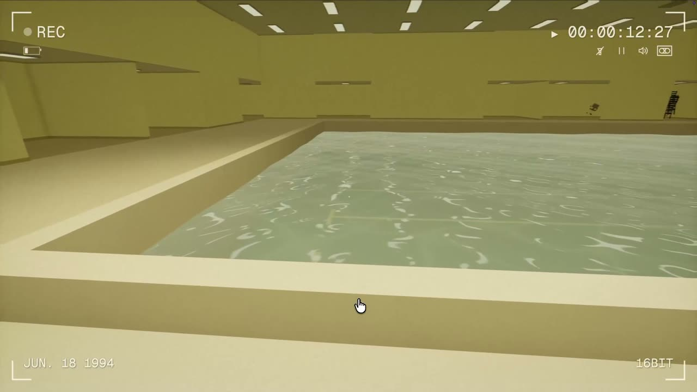
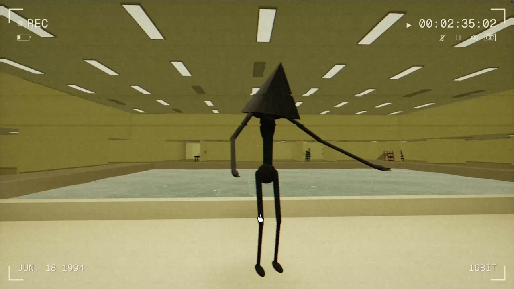
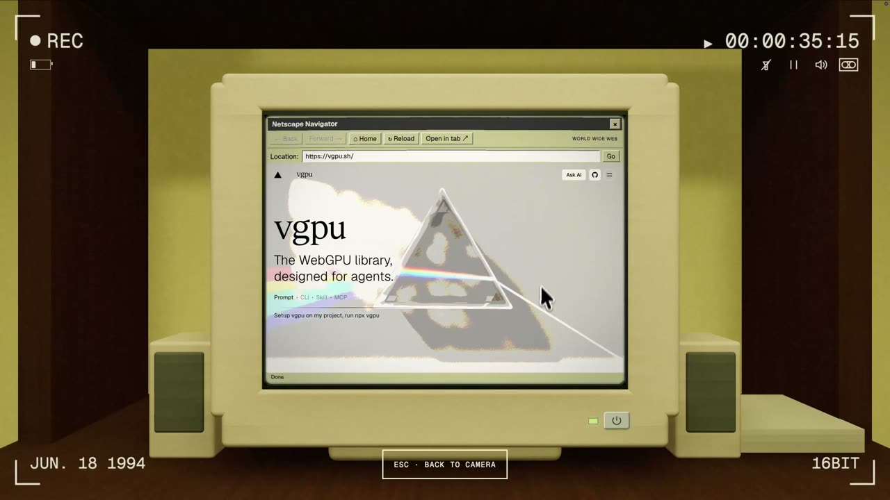
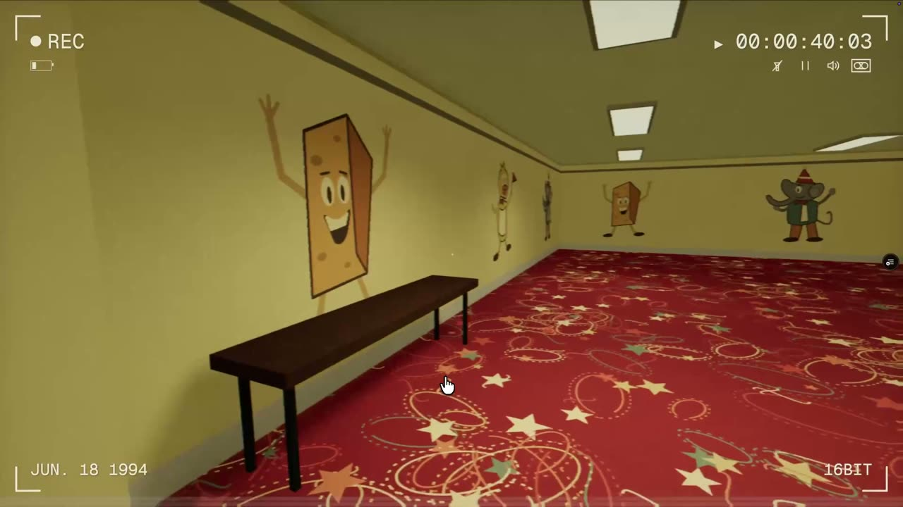
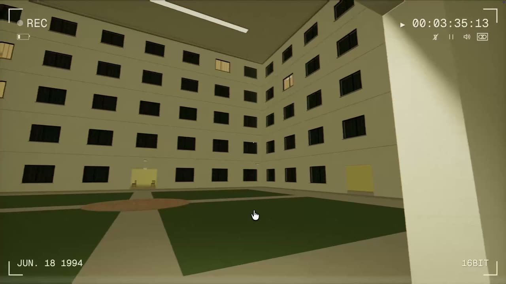
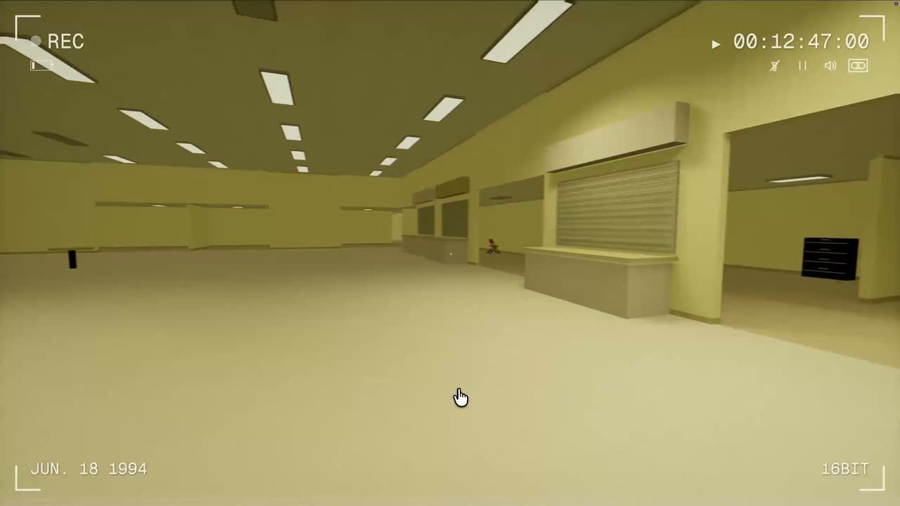

# vackrooms

An endless first-person backrooms game, presented as a damaged VHS recording from June 18, 1994. Everything you see is generated in your browser from a tape seed: the office maze, the furniture, the poolrooms, the thing that follows you.

**[Play it at vackrooms.vercel.app](https://vackrooms.vercel.app)**

[](https://vackrooms.vercel.app)

Built with Next.js, Three.js, Rapier, and [vgpu](https://github.com/vercel-labs/vgpu). Runs on WebGPU, with a WebGL2 fallback. No accounts, no backend, no downloaded level data.

## What's in there

| | |
| --- | --- |
|  |  |
| **Poolrooms.** Recessed 25×16m basins with WGSL water, caustics, and wet footsteps. | **Something else is in here.** It stalks, freezes when watched, and runs when you do. |
|  |  |
| **Working computers.** Chunky 90s CRTs that load real websites, with a dial-up handshake. | **Level Fun.** Rare seeded party rooms. |
|  |  |
| **Covered courtyards.** Sealed upper-floor overlooks you can never quite reach. | **Landmarks.** Lobbies, food courts, and 170m corridors between the offices. |

- **Endless and seeded.** Every visit draws a new tape. Add `?tape=199307` to the URL to replay a specific maze, or use Cassette settings → COPY TAPE LINK to share yours.
- **Rooms change when you are not looking.** Unseen sections mutate; landmarks stay put.
- **Noclip.** Hold E on an unstable wall to fall to a deeper level.
- **Spatial sound.** HRTF panning, traced wall occlusion, per-room reverb, and footsteps that are sometimes not yours.
- **VHS pipeline.** Tape warp, tracking errors, chroma offset, bloom, and grain, all on the GPU.

## Run it locally

You need Node 20 or newer (CI uses 24).

```sh
git clone https://github.com/pablostanley/vackrooms.git
cd vackrooms
npm ci
npm run dev
```

Open http://localhost:3000 and click Record. A WebGPU browser with hardware acceleration gets the vgpu pipeline; WebGL2 browsers get a GLSL compatibility pass. There are no environment variables or service keys to set up.

## Controls

| Input                        | Action                                |
| ---------------------------- | ------------------------------------- |
| WASD / arrow keys            | Walk                                  |
| Mouse / click and drag       | Look                                  |
| Shift                        | Run                                   |
| Space                        | Jump onto low objects                 |
| Space again while airborne   | Bigger double jump (once per landing) |
| F                            | Toggle flashlight (off by default)    |
| Hold E near an unstable wall | Noclip to a deeper level              |
| E near a computer            | Focus its live browser                |
| Escape                       | Leave computer / pause                |

Touch devices get a movement stick, swipe-to-look, and contextual buttons. Standard Xbox and PlayStation-style gamepads work too; the full mapping is in [docs/ARCHITECTURE.md](docs/ARCHITECTURE.md#jumping-settings-and-gamepads).

Sound, look sensitivity, tape damage, and a steady-camera comfort option live in the cassette settings and are saved in your browser only. System reduced-motion preferences are respected.

## How it works

The short version: a seeded maze generator streams a 3×3 window of 57.6m sections around the player, each with one guaranteed landmark. Geometry, materials, and furniture are batched procedural meshes. Rapier drives a kinematic character capsule. A Three.js render pipeline runs the scene through WGSL tape shaders authored with vgpu. Audio is Web Audio with traced acoustics. The game loop is entirely client-side and deterministic per tape.

| Path | What lives there |
| --- | --- |
| `src/lib/game/maze.ts`, `landmarks.ts`, `world.ts` | Generation and section streaming |
| `src/lib/game/engine.ts`, `physics.ts` | Game loop, controls, Rapier movement |
| `src/lib/game/stalker.ts`, `entity-*.ts` | Creature behavior, navigation, model, gait |
| `src/lib/game/computer-*.ts` | CRT workstations and the in-world browser |
| `src/lib/game/audio.ts`, `acoustics.ts` | Spatial audio and room acoustics |
| `src/lib/game/renderer.ts`, `src/shaders/*.wgsl` | VHS, water, CRT, and noise shaders |
| `tests/` | Node test suites for generation, physics, audio, and behavior |

The module-by-module tour, including the computer browsing model and its iframe limits, is in **[docs/ARCHITECTURE.md](docs/ARCHITECTURE.md)**.

## Checks

```sh
npm test
npm run typecheck
npm run lint
npm run check:shaders
npm run build
```

`check:shaders` validates the WGSL with vgpu; a passing Next.js build alone does not. In development, add `?renderer=webgl` to exercise the fallback on a WebGPU-capable browser. The same checks run in GitHub Actions on every push and pull request.

## Deploy

It is a static Next.js shell with a client-side game, so any Next.js host works. On Vercel:

```sh
npx vercel@latest deploy
```

Vercel Web Analytics and Speed Insights are wired in and do nothing unless you enable them on your own project.

## Contributing

Issues and pull requests are welcome. A few things keep the game feeling like itself:

- Keep gameplay client-side, deterministic by tape seed, and bounded to resident sections.
- When you touch generation, verify connectivity and matching boundary gates (the maze and landmark tests do this).
- Main rooms stay oppressively bright and fluorescent: sickly yellow, damp brown carpet, no natural blue. The only interface is the camcorder HUD.
- Check visual and interaction changes in a real browser, not only in tests.

`AGENTS.md` has the same guidance for coding agents.

Not built yet: swimming, ledge-grab animations, and more advanced platforming.

## Credits and license

Made by [Pablo Stanley](https://pablostanley.com), in the tradition of the Backrooms creepypasta and the many games and videos it inspired.

The source code is released under the [MIT License](LICENSE).

Audio has its own terms, documented in [`public/audio/README.md`](public/audio/README.md): footsteps, creaks, cloth, and the flashlight click come from [Kenney's RPG Audio](https://kenney.nl/assets/rpg-audio) pack (CC0). The dial-up and shallow-water recordings are third-party sound effects that are not covered by the MIT license; replace them if you redistribute the game.
